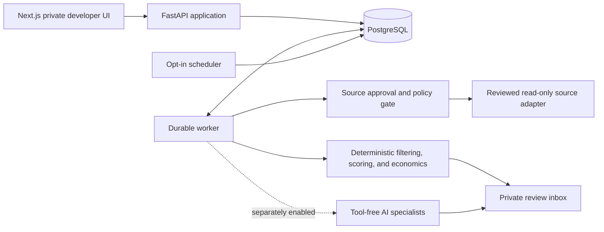

# MarginScout

MarginScout is a personal, single-user software engineering project used privately by its developer. It explores how an external dashboard can organize and evaluate publicly available posts about freelance, creative, technical, and business-service opportunities. This public repository is a deliberately limited engineering portfolio and API-review package with architecture documentation and a runnable sample of the read-only source-integration boundary.

> MarginScout is not sold, hosted for other users, or offered as a data-distribution or outreach service. This is not the complete private development repository, and it contains no credentials, real user or provider data, private scoring configuration, model prompts, deployment configuration, or concrete live Reddit transport. Live Reddit access is disabled unless Reddit approves the stated personal, read-only use.

## What the private application does

- Captures, normalizes, and deduplicates opportunity-candidate evidence.
- Matches demand to a reviewed catalog of services and provider coverage.
- Explores deterministic service-economics and confidence ranges as an engineering exercise.
- Uses optional, bounded AI inference for extraction and classification while keeping calculations and workflow decisions deterministic. Source content is not used to train or fine-tune a model.
- Persists long-running work in a PostgreSQL-backed durable queue.
- Exposes provenance, evidence, configuration versions, model usage, and failure states for developer review.
- Never applies, purchases, posts, comments, votes, messages, or contacts a person automatically.

## Engineering highlights

- **Auditable decisions:** append-only run records preserve inputs, evidence, configuration hashes, costs, and warnings.
- **Fail-closed integrations:** approval, scope, credential, host, request-limit, and retention checks occur before transport access.
- **Human authority:** model output is advisory; lifecycle changes and external actions require the developer.
- **Cost-aware AI routing:** deterministic filtering precedes optional inference calls, and stronger models are reserved for narrower classification tasks.
- **Operational resilience:** idempotent PostgreSQL jobs, atomic claims, bounded retries, stale-run recovery, health checks, and metrics.
- **Untrusted-content handling:** source text cannot issue tool calls or override application policy.

## System overview



The complete private application uses Next.js, React, TypeScript, FastAPI, Pydantic, SQLAlchemy, Alembic, PostgreSQL, Docker Compose, pytest, and optional model-based inference. See [the architecture overview](docs/ARCHITECTURE.md) for the trust boundaries and data flow.

## Public source excerpt

The included Python package demonstrates several application-style boundaries without publishing the complete private project:

- a frozen Reddit approval scope and strict community allowlist;
- a read-only `/new` listing request path with injected OAuth and transport protocols;
- deterministic, factor-by-factor opportunity ranking with explicit caps;
- an idempotent background-job service with validated state transitions;
- configuration-driven AI task routing and Decimal-based cost estimates;
- a small FastAPI surface exposing readiness, capabilities, and assessment; and
- deletion/account-deletion and time-based redaction decisions.

The tests use only synthetic payloads. They make no Reddit or third-party request.

```text
src/marginscout_public/
  api.py                 sanitized FastAPI application
  jobs.py                idempotent job lifecycle and store protocol
  model_routing.py       configurable AI tier and budget decisions
  reddit_client.py       approval-gated request and normalization boundary
  retention.py           deletion and retention decisions
  scoring.py             transparent deterministic opportunity score
examples/
  OpportunityAssessmentCard.tsx accessible typed React review component
tests/
  ...                    zero-network unit and API tests
```

Run the excerpt with Python 3.11 or newer:

```bash
python -m pip install -e ".[dev]"
python -m unittest discover -s tests -v
python tools/audit_release.py
```

No API key, Reddit account, database, or external network call is required by the tests. After installation, the demonstration API can be started with:

```bash
uvicorn marginscout_public.api:app --reload --port 8010
```

Its interactive documentation is then available at `http://localhost:8010/docs`.

## Reddit API request status

MarginScout currently processes only developer-supplied content and bundled synthetic fixtures. The proposed live integration is read-only and limited to newest-post listings in an explicitly approved subreddit allowlist. It does not vote, post, comment, message, scrape HTML, or automate outreach. If the developer chooses to respond to a post, they will open the original Reddit page and interact manually as a normal Reddit user.

The intended collection, retention, and deletion behavior is described in [Reddit API use](docs/REDDIT_API_USE.md) and the public [Privacy and Deletion Policy](PRIVACY.md). A transparent draft for the access request is in [Reddit API application](docs/REDDIT_API_APPLICATION.md). Implementation and activation remain contingent on Reddit's written approval and the exact scope of the resulting agreement.

## Repository scope

Included:

- architecture and trust-boundary documentation;
- privacy, retention, and Reddit-access intent;
- a non-operational integration boundary;
- synthetic unit tests and a publication audit; and
- a recruiter-oriented description of engineering decisions.

Intentionally excluded:

- the complete private backend and frontend;
- database models and migrations;
- proprietary scoring weights, prompts, research logic, and marketplace strategy;
- environment files, OAuth credentials, API keys, logs, backups, and real records; and
- any operational Reddit connector.

This repository is source-visible for portfolio evaluation and API review; it is not a hosted service or the complete private project. See [LICENSE.md](LICENSE.md).

## Author

Built by **David Plam**. — [GitHub](https://github.com/DPLCoding) · [LinkedIn](https://linkedin.com/in/david-plam)
