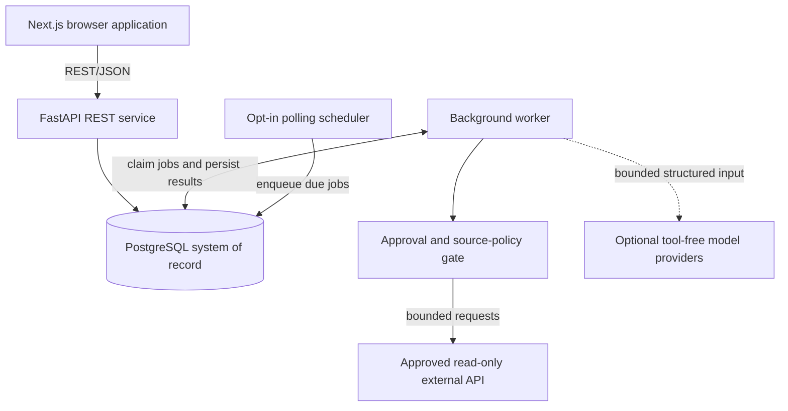
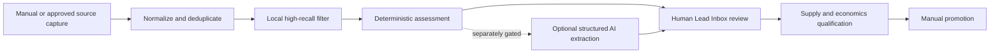

# Architecture overview

## Product boundary

MarginScout is a single-operator decision-support application. It separates source evidence, deterministic business rules, optional model interpretation, and human workflow state so that an uncertain model response cannot silently become a financial fact or external action.

The complete product is private. This document intentionally describes components and controls without exposing proprietary prompts, scoring weights, provider records, or deployment details.

## Runtime topology



- **Next.js** owns presentation and form state.
- **FastAPI** owns validation, canonicalization, state transitions, and API contracts.
- **PostgreSQL** is the system of record and durable job queue.
- **Workers** claim idempotent jobs atomically and persist progress, retries, costs, and outcomes.
- **Source adapters** are the only components permitted to perform approved external reads.
- **Model specialists** have no tools and cannot send messages, purchase services, or alter deterministic calculations.

## Opportunity lifecycle



A discovered record begins as source evidence. It becomes a lead only when it merits review, and it becomes a commercial opportunity only after explicit operator promotion. Filtering, ranking, or model output cannot perform that promotion.

## Reddit feed-first proposal

The proposed Reddit integration polls only bounded newest-post listings for an approved community allowlist. It does not schedule keyword-by-community search fan-out.

```mermaid
sequenceDiagram
    participant S as Scheduler
    participant Q as Durable queue
    participant G as Approval gate
    participant R as Reddit OAuth API
    participant P as Lead pipeline
    participant H as Human operator

    S->>Q: Enqueue due source window
    Q->>G: Claim idempotent read job
    G->>G: Check written approval, expiry, scope, rate, retention health
    alt gate is current
        G->>R: GET approved /r/{community}/new
        R-->>G: Listing and rate-limit headers
        G->>P: Normalize bounded records
        P->>P: Deduplicate, filter, assess, route
        P-->>H: Review candidates
    else gate fails
        G-->>Q: Fail closed; no network request
    end
```

Live activation additionally requires environment-only OAuth credentials, truthful User-Agent identification, persistent rate accounting, source-edit and deletion reconciliation, approved attribution, and a public privacy/deletion path.

## Trust boundaries

### Source content

Marketplace and social content is untrusted data. It is character-bounded, normalized, and never interpreted as an instruction. Source text cannot choose tools, URLs, models, credentials, or workflow transitions.

### AI output

Optional model output must satisfy structured schemas and cite source evidence. It may suggest extracted requirements or ambiguities. It cannot override monetary arithmetic, approval gates, hard risk controls, lifecycle status, or external permissions.

### Secrets

Secrets remain in the runtime environment or a deployment secret manager. Database records may reference an environment-variable name but never contain the credential value. Logs omit request bodies, authorization headers, connection strings, and query strings.

### External actions

MarginScout exposes no automated apply, buy, post, comment, direct-message, email, or payment workflow. External communication remains a deliberate human action outside this source adapter.

## Reliability and observability

- Unique idempotency keys prevent duplicate execution for the same source window.
- Atomic database claims prevent two workers from processing one job.
- Retry counts and stale-claim recovery are bounded.
- Partial source failures remain visible rather than being flattened into success.
- Runs preserve source provenance, decision counts, warnings, latency, token usage, and estimated cost.
- Readiness distinguishes API-process health from database and durable-queue availability.

